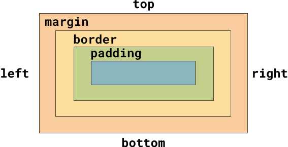

The diagram below shows the **box model**. This is used to help web designers see which values they need to adjust in order to get their margins, padding and borders the right size. 

The `margin` property is the outermost area of the element. 

The `border` nests inside the `margin`. 

The `padding` nests inside the `border`.

The space in the centre shows the content within the element. 

The code below shows the settings for the `margin` and `padding` properties. 

--- code ---
---
language: CSS
filename: style.css
line_numbers: false
line_number_start: 1
line_highlights: 4, 7
---
main {
  background: var(--primary); /* Colour the background */
  color: var(--onprimary); /* Colour the text */
  margin: 0 auto; /* Center if the browser is really wide */
  min-width: 25rem; /* Don't let the content get too narrow */
  max-width: 70rem; /*  Don't let the content get too wide */
  padding: 0;
  padding-top: 0.5rem; /* Padding at the top */
  margin-bottom: 1em; /* Gap before the footer */
}
--- /code ---

You can also specify the side of the content that you wish to add margins, padding and borders to. 

--- code ---
---
language: CSS
filename: style.css
line_numbers: false
line_number_start: 1
line_highlights: 8-9
---
main {
  background: var(--primary); /* Colour the background */
  color: var(--onprimary); /* Colour the text */
  margin: 0 auto; /* Center if the browser is really wide */
  min-width: 25rem; /* Don't let the content get too narrow */
  max-width: 70rem; /*  Don't let the content get too wide */
  padding: 0;
  padding-top: 0.5rem; /* Padding at the top */
  margin-bottom: 1em; /* Gap before the footer */
}
--- /code ---