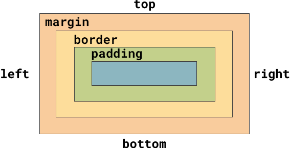

下图显示了**盒子模型**。 网页设计师使用此模型来查看需要调整哪些值才能使外边距、内边距和边框达到正确的大小。

`margin` 属性是元素的最外层区域。

`border` 嵌套在 `margin` 里面。

`padding` 嵌套在 `border` 内。

中心的空间显示元素内的内容。

下面的代码显示了 `margin` 和 `padding` 属性的设置。

--- code ---
---
language: CSS
filename: style.css
line_numbers: false
line_number_start: 1
line_highlights: 5, 8
---
main {
  background: var(--primary); /* 为背景着色 */
  color: var(--onprimary); /* 为文本着色 */
  margin: 0 auto; /* 如果浏览器非常宽，则居中 */
  min-width: 25rem; /* 不要让内容太窄 */
  max-width: 70rem; /* 不要让内容太宽 */
  padding: 0;
  padding-top: 0.5rem; /* 顶部内边距 */
  margin-bottom: 1em; /* 页脚前的间隙 */
}
--- /code ---

你还可以指定要在内容的哪一侧添加外边距、内边距和边框。

--- code ---
---
language: CSS
filename: style.css
line_numbers: false
line_number_start: 1
line_highlights: 9-10
---
main {
  background: var(--primary); /* 为背景着色  */
  color: var(--onprimary); /* 为文本着色 */
  margin: 0 auto; /* 如果浏览器非常宽，则居中 */
  min-width: 25rem; /* 不要让内容太窄 */
  max-width: 70rem; /* 不要让内容太宽 */
  padding: 0;
  padding-top: 0.5rem; /* 顶部内边距 */
  margin-bottom: 1em; /* 页脚前的间隙 */
}
--- /code ---
